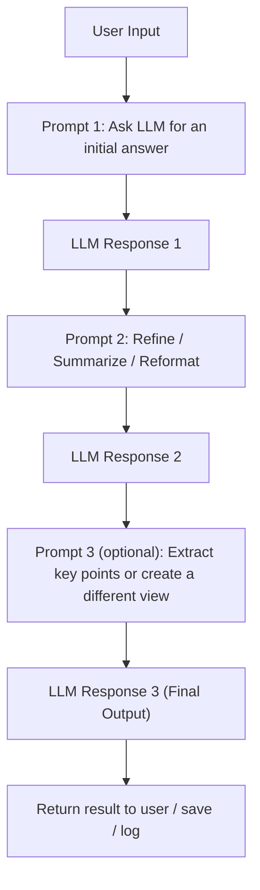

## LangChain Prompt Chaining Demo

This project is a small TypeScript/Node demo that uses **LangChain** and **OpenRouter** to explore the idea of **prompt chaining** with chat models.

Instead of sending one big prompt to a model, you break your work into multiple, smaller prompts that feed into each other. Each step can:
- Refine or expand the previous answer
- Extract specific pieces of information
- Transform the output into a new format (summary, outline, code, etc.)

### High‑level idea

- **Input**: You start with a user question or topic.
- **Step 1 – Initial response**: The LLM generates a first, general answer.
- **Step 2 – Processing step(s)**: One or more follow‑up prompts take that answer as input and:
  - Clean it up, summarize it, or re‑structure it
  - Pull out bullet points, key terms, or action items
  - Ask the model to “reason further” based on what it already produced
- **Step 3 – Final result**: You return a polished, structured output to the user (e.g., a short explanation, a study guide, or an outline).

### Prompt chaining flow (conceptual)

The exact implementation can vary, but the conceptual flow looks like this:



In code, this typically looks like:
- **Create a `ChatOpenAI` instance** configured to use an OpenRouter model.
- **Call `llm.invoke(...)`** with a first prompt (e.g., “Explain LangChain in two lines”).  
- **Pass the result text into the next prompt** (e.g., “Convert this explanation into bullet points”).
- Continue chaining steps until you get the shape of answer you want.

### Environment & setup

- Uses `@langchain/openai` with OpenRouter as the backend.
- Loads environment variables via `dotenv` (`import "dotenv/config"`).
- TypeScript is configured for ESM (`"type": "module"`, `"module": "NodeNext"`).

To run it locally (after cloning):

```bash
npm install

# Make sure OPENROUTER_API_KEY is set in a .env file or your environment
npx ts-node index.ts
```

This will execute the main script, call the model through LangChain, and log the chained result to the console.


